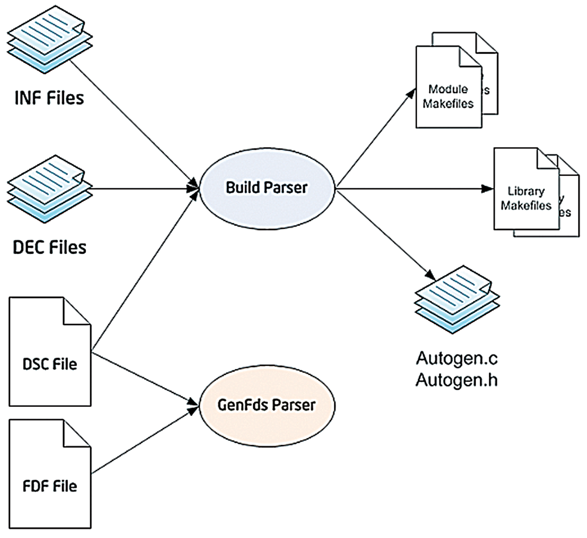
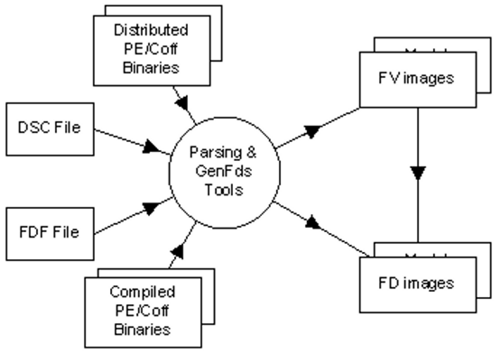

<!--- @file
  2.1 Processing Overview

  Copyright (c) 2006-2017, Intel Corporation. All rights reserved. 

  Redistribution and use in source (original document form) and 'compiled'
  forms (converted to PDF, epub, HTML and other formats) with or without
  modification, are permitted provided that the following conditions are met:

  1) Redistributions of source code (original document form) must retain the
     above copyright notice, this list of conditions and the following
     disclaimer as the first lines of this file unmodified.

  2) Redistributions in compiled form (transformed to other DTDs, converted to
     PDF, epub, HTML and other formats) must reproduce the above copyright
     notice, this list of conditions and the following disclaimer in the
     documentation and/or other materials provided with the distribution.

  THIS DOCUMENTATION IS PROVIDED BY TIANOCORE PROJECT "AS IS" AND ANY EXPRESS OR
  IMPLIED WARRANTIES, INCLUDING, BUT NOT LIMITED TO, THE IMPLIED WARRANTIES OF
  MERCHANTABILITY AND FITNESS FOR A PARTICULAR PURPOSE ARE DISCLAIMED. IN NO
  EVENT SHALL TIANOCORE PROJECT  BE LIABLE FOR ANY DIRECT, INDIRECT, INCIDENTAL,
  SPECIAL, EXEMPLARY, OR CONSEQUENTIAL DAMAGES (INCLUDING, BUT NOT LIMITED TO,
  PROCUREMENT OF SUBSTITUTE GOODS OR SERVICES; LOSS OF USE, DATA, OR PROFITS;
  OR BUSINESS INTERRUPTION) HOWEVER CAUSED AND ON ANY THEORY OF LIABILITY,
  WHETHER IN CONTRACT, STRICT LIABILITY, OR TORT (INCLUDING NEGLIGENCE OR
  OTHERWISE) ARISING IN ANY WAY OUT OF THE USE OF THIS DOCUMENTATION, EVEN IF
  ADVISED OF THE POSSIBILITY OF SUCH DAMAGE.

-->

## 2.1 Processing Overview

The EDK II FDF file describes information about flash parts as well as rules
for combining binaries (Firmware Image) built from a DSC file. Additionally, if
a DSC file specifies a `FLASH_DEFINITION` file, then the EDK II tools will
locate the FDF file (looking in the same directory as the DSC file, then the
parsing utilities will scan the FDF file to gather PCD information that can be
used by AutoGen utilities for building components or modules. The output of the
first phase of an EDK II build (as defined in the EDK II Build Specification)
generates valid PE32/PE32+/Coff image files. The second phase of the build
process consumes the images generated during the first phase, using statements
and rules defined in the FDF file to process the PE32/PE32+/Coff images files
into one or more EFI sections. The EFI sections may get combined with other
optional sections (version, depex, user interface) sections, into EFI Firmware
File system (FFS) Sections. FFS images are put into Firmware Volumes (FVs,) and
finally, the FV sections are combined into one or more Flash Device binary
image (FD).

The following diagrams illustrate the process flow for generating the
PE/PE32+/Coff files that will be used for Flash Image files.

###### Figure 1 EDK II Build Data Flow

The following diagram shows the overview of the process used to create final
image files.

###### Figure 2 EDK II Create Image Flow

It should be noted that some `SEC`, `PEI_CORE` and/or `PEIM` modules are coded
XIP (eXecute In Place) running directly from ROM, rather than from memory. For
modules that always execute from ROM, the relocation (`.reloc`) section of the
PE32 image can be removed (after running a fix up tool) as a space saving
technique. Some PEIM modules may run from either ROM or from memory. There are
several methods that can be used to retain this information (as well as the
.reloc sections of stripped images). Due to this possibility, the `SEC`,
`PEI_CORE` and `PEIM` descriptions are different from the remaining module
types. The default for all `SEC`, `PEI_CORE` and `PEIM` modules is to strip the
`.reloc` section. The modules coded to use `REGISTER_FOR_SHADOW` must not have
the `.reloc` section stripped.

Also of note, not all of the INF files listed in the FDF file need to be listed
in the DSC file. Since the DSC file is primarily used to generate Makefiles for
a build, binary only modules do not need to be listed in a DSC file, and can be
listed in the FDF file.

### 2.1.1 Platform Configuration Database (PCD) Settings

The FD, FV and Capsule sections (and nested sections) permit setting PCD
default values. All PCDs must be declared in a DEC file in order to be used. It
is recommended that the PCDs set in the FDF file be for Addresses, Sizes,
and/or other "fixed" information needed to define or create the flash image.
Use of PCDs is permitted in the FDF file. The `Dynamic` and `DynamicEx` PCDs
can be accessed or modified during execution, as result, they cannot be set
within the FDF file.

**********
**Note:** The PCD values set in this file are assumed to be correct on all
conditions that the reset vector in SEC is executed, such as power-on, reset
and ACPI S3 resume. Use of the PatchableInModule PCD access method for base
addresses is permitted, but when this PCD access method is used, module
implementations must always access the values through the PcdGet() and PcdSet()
operations to guarantee that stale base address values are never used.
**********

All FLASH related PCD settings MUST be set in the FDF file, not in the platform
description (DSC) file. The FDF file has the final values for Flash Related
PCDs. If a DSC file contains a duplicate PCD setting, the FDF file's PCD
setting takes precedence and it is recommended that the build tools throw a
warning message on the PCD defined in the DSC file. Default values from DEC
files are not permitted in the EDK II build system for PCDs specified in the
FDF file.

PCD values set in this file override PCD settings in other EDK II meta-data
files. Note that PCDs settings are positional within the FDF file.

Additionally, the PCDs used in the FDF file must be specified as:

`PcdTokenSpaceGuidCName.PcdCName`

#### PCD RULES

There are no PCD sections defined for the FDF file. PCD values are assigned in
the FDF file using two methods. They may automatically be assigned based on a
specific position (as defined in the FDF specification) or by using a SET
statement.

* Within the `[FD]` sections, PCDs that appear immediately following the line
  containing address|size or offset|size values will have their values
  automatically assigned to the address|size or offset|size using the same
  ordering. Additionally, some tokens, such as `BaseAddress`, which use a
  format of token = value, can have a PCD's value set at the same time. The PCD
  must be on the same line, and be separated from the value by field separator
  character.If there are two values on the line, separated by a field separator
  character, the PCD names that will be assigned the values must appear on the
  next line, and must also be separated by the field separator character.

* Specific tokens assigned to values within the FD sections can have a PCD
  automatically assign the same value by placing a field separator character
  between the value and PCD name. The PCD name must always follow the value
  field separator character sequence.

* Other PCDs may be assigned using the `SET` statement in the FDF file.

* PCD Values assigned in this file (using `SET PcdName = value`) override
  values assigned in the DSC file, or, if a value is not specified in the DSC,
  then they will override values assigned in an INF file, or if a value is not
  specified in the DSC or the INF, then they will override values assigned in
  the DEC file.

* Dynamic and DynamicEx PCDs cannot be set in the FDF file.
